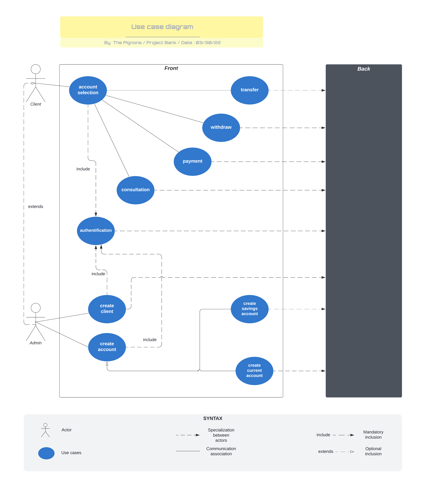
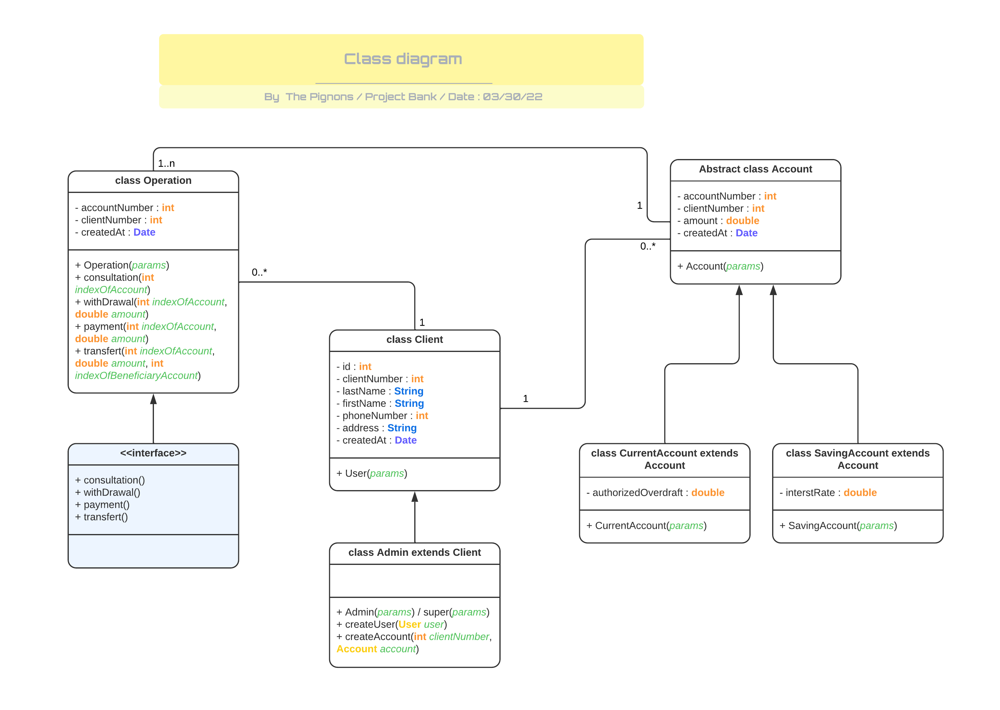
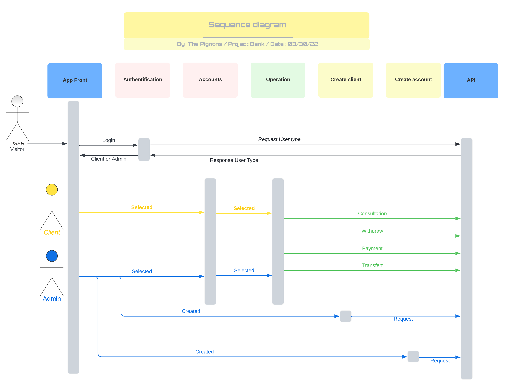

# **Banque en ligne**

## **Etapes**

- [x] :triangular_ruler: Diagramme cas d'utilisation
- [x] :triangular_ruler: Diagramme de classes
- [x] :triangular_ruler: Diagramme de séquence
- [x] :closed_book: Mise en place de la couche business
- [ ] :blue_book: Mise en place des entités
- [ ] :green_book: Ajout des méthodes
- [ ] :bug: Corrections des bugs
- [ ] :trophy: Version finale

*Progression à venir par la suite*

--- 

## **Captures**

### **Diagramme de cas d'utilisation** :

### **Diagramme de classes** :

### **Diagramme de séquence** :

---

### **Aides**

pour cloner le repository :

`git clone https://github.com/sebastiena299/Challenge-UML.git`